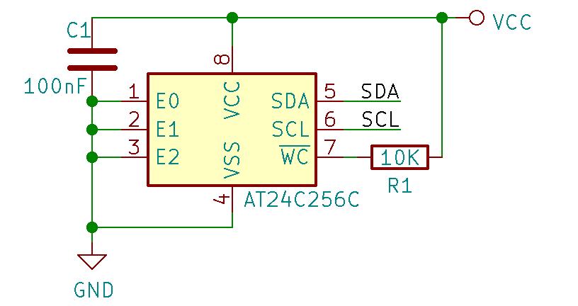

# Badge Add-On Identification System

This document suggests a standard for Shitty Add-On identification system.
The purpose is to let the badge know which add-on was plugged-in, and 
run the relevant app / driver, optionally prompting the user first.

## Hardware

The system is implemented by adding a 2kbit (256 byte) EEPROM. It is suggested
to pull-up the write protect (sometimes also called WC, "Write Control") pin of
the EEPROM with a 10kOhm resistor, to minimize the risk of accidential erasure.
A decoupling 0.1uF capacitor, as close as possible to the EEPROM's VCC pin, is
recommended as well.

The I2C address of The EEPROM must be 0x50, so all of the address pins have to
be connected to ground (or at least pulled-down).



## EEPROM Layout

The EEPROM contains a single descriptor that identifies the add-on. The 
descriptor includes information such as the name of the add-on, the name
of the application / driver that should be executed when the add-on is 
plugged, and optionally, extra payload data in application-specific format.

There are two variants of the descriptor: Binary and JSON descriptor. The
binary format is more compact, making it possible to fit larger application
payload into the EEPROM.

### Binary Descriptor

The Binary descriptor start with the following header:

| Offset | Size    | Description 
| ------ | ----    | -----------
| 0      | byte[4] | Magic string: 'LIFE' (bytes 4C 49 46 45)
| 4      | byte    | Length of device name
| 5      | byte    | Length of driver name
| 6      | byte    | Length of driver data buffer
| 7      | byte    | Reserved, must be 0

The header is followed by device name, driver name, and optionally
a driver data buffer. The length of each of these elements is 
specified in the header. The device name string may be UTF-8 encoded.
The driver name string must be ASCII encoded.

Binary Descriptor example:

```
00000000  4c 49 46 45 10 0a 04 00  4d 79 20 61 6d 61 7a 69  |LIFE....My amazi|
00000010  6e 67 20 61 64 64 6f 6e  61 6d 61 7a 69 6e 67 2e  |ng addonamazing.|
00000020  70 79 01 ff ff ff                                 |py....|
```

In the above example, the Add-on name is `My amazing addon`, the driver name
is `amazing.py`, and the application-specific payload is `01 ff ff ff`.

### JSON Descriptor

The JSON descriptor has a 5-byte header, followed by JSON data:

| Offset | Size    | Description
| ------ | ----    | -----------
| 0      | byte[4] | Magic string: 'JSON'
| 4      | byte    | Length of JSON Data
| 5      | byte[n] | JSON payload, UTF-8 encoded 

The JSON payload must contain the following fields:

| Field  | Description
| -----  | -----------
| name   | The device name
| driver | The driver name

It may contain additional fields that will be processed by the driver.

For example: 

```json
{
  "name": "My amazing addon",
  "driver": "amazing.py" 
}
```
